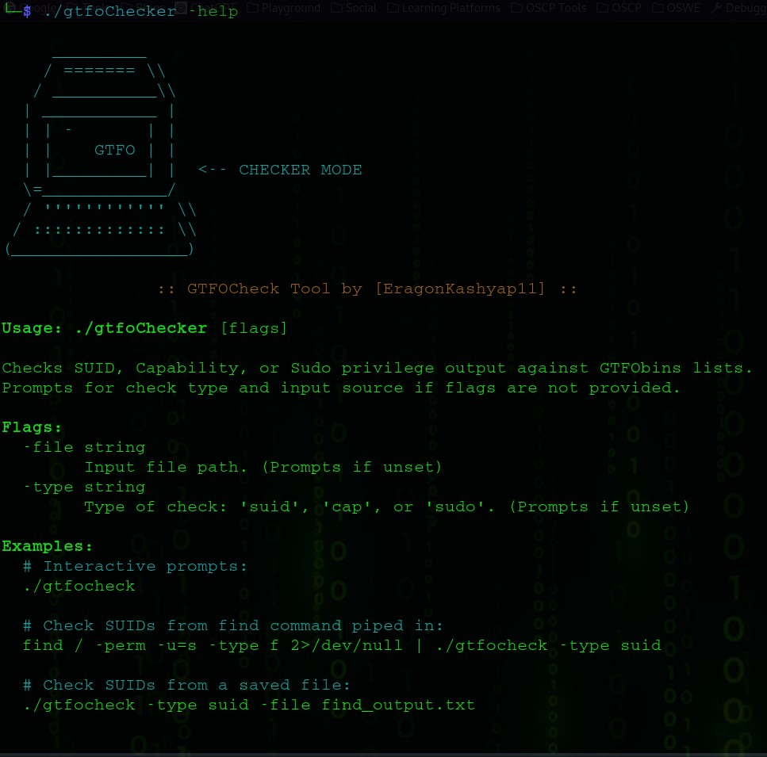

## 🛠️ Description

**GTFOChecker** is a lightweight command-line tool written in Go, designed to quickly identify potential privilege escalation vectors on Linux systems.

It cross-references the output of common enumeration commands (`find` for SUID files, `getcap` for file capabilities, and `sudo -l` for sudo rights) against curated lists of known exploitable binaries from [GTFOBins](https://gtfobins.github.io/).

This tool is particularly useful for:
- 🏴‍☠️ Capture The Flag (CTF) challenges
- 🛡️ Penetration testing engagements
- 🔍 System security audits


## ✨ Features

- **SUID Check**  
  Analyze output of `find / -perm -u=s -type f` for SUID escalation opportunities.

- **Capabilities Check**  
  Analyze output of `/usr/sbin/getcap -r /` for file capabilities that allow privilege escalation.

- **Sudo Check**  
  Analyze output of `sudo -l` to identify misconfigured sudo permissions.

- **Flexible Input Methods**
  - Read from standard input (piping)
  - Read from a file (`-file` flag)
  - Interactive prompts if neither is specified

- **Colorized Output**  
  Findings are highlighted in **red** for easy identification.

- **Sudo ALL Warning**  
  Special alert when dangerous `sudo ALL` rules are detected.


## ⚡ Motivation

Manually checking the outputs of `find`, `getcap`, and `sudo -l` against GTFOBins can be slow and error-prone during time-sensitive operations.

**GTFOChecker** automates this tedious process so you can spend more time **exploiting**, **pivoting**, and **owning** systems.


## 📦 Installation / Compilation

1. Ensure you have **Go (1.18+)** installed.
2. Clone or download this repository.
3. Compile the tool:

```bash
go build gtfoChecker.go
```

This will generate an executable called `gtfoChecker` in your working directory.


## 🚀 Usage

You can run GTFOChecker **interactively** or via **flags**.


### 1. Interactive Mode

Simply run:

```bash
./gtfoChecker
```

You will be prompted for:
- The type of check (`suid`, `cap`, or `sudo`)
- Input method (paste or file)

---

### 2. Piping Output Directly

Run system enumeration commands and pipe results directly into GTFOChecker.

#### 📍 SUID Check

```bash
find / -perm -u=s -type f 2>/dev/null | ./gtfoChecker -type suid
```

#### 📍 Capabilities Check

```bash
/usr/sbin/getcap -r / 2>/dev/null | ./GTFOCheckerer -type cap
# Or
getcap -r / 2>/dev/null | ./gtfoChecker -type cap
```

#### 📍 Sudo Check

```bash
sudo -l | ./gtfoChecker -type sudo
```

---

### 3. Using a File as Input

Save enumeration output into a file and use the `-file` flag.

#### 📍 SUID Check from File

```bash
find / -perm -u=s -type f 2>/dev/null > suid_results.txt
./gtfoChecker -type suid -file suid_results.txt
```

#### 📍 Capabilities Check from File

```bash
/usr/sbin/getcap -r / 2>/dev/null > cap_results.txt
./gtfoChecker -type cap -file cap_results.txt
```

#### 📍 Sudo Check from File

```bash
sudo -l > sudo_results.txt
./gtfoChecker -type sudo -file sudo_results.txt
```

---

### 4. Help Menu

To see all available options:

```bash
./gtfoChecker -h
```

---

## 📋 Output

GTFOChecker will display:
- Header indicating the type of check.
- Matched binaries (highlighted in **red**).
- Warning message if `sudo ALL` privilege escalation is detected.
- Summary of findings (number of matches).
- "No matches found" if nothing exploitable is detected.

---

## 🔗 Dependencies

- **Go (>= 1.18)** — for building the binary.
- **Target System Tools**:
  - `find`
  - `getcap`
  - `sudo`

(Required for generating input.)


## ⚠️ Disclaimer

> **This tool is intended for educational and authorized penetration testing purposes only.  
> Unauthorized usage on systems without permission is illegal.**


## 🤖 Author

Developed with 💻 and ⚡ by **EragonKashyap11**

